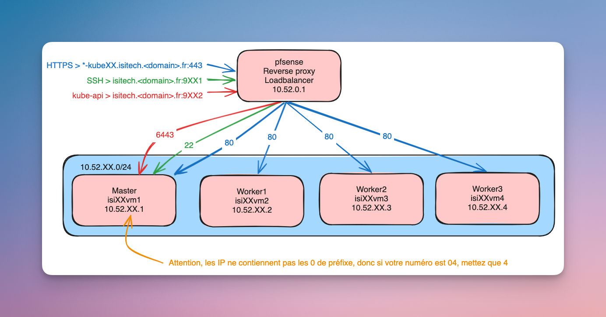

# Kubernetes - Scripts

Ce dossier contient les différents scripts et fichiers de config nécessaires au bon déroulé de ce cours.

Les dossiers sont triés dans l'ordre, je vous invite à y référer durant le cours et à poser vos questions si nécessaire.

## Réseau et infrastructure de cours :

Des machines virtuelles sont fournies par le professeur pour ce cours.

Les étudiants seront regroupés par groupes avec un numéro `XX` attribué pour son cluster.

Les VMs étaient sur la même IP publique, les ports et protocoles standards sont remplacés par des ports attribués aux 
étudiants.

Voici un schéma des protocoles SSH, HTTPS et Kube-api mis en place pour ce cours :

> Le `<domain>` sera fourni par le professeur durant le cours.
> Notez que `XX` doit être remplacé partout dans l'illustration.

